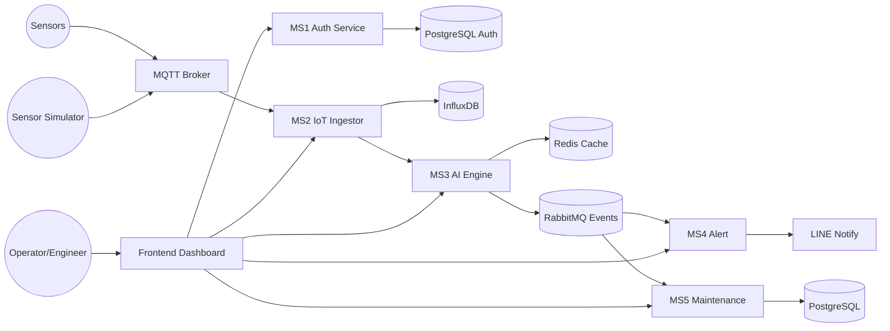

# OmniVigil

ระบบ Cloud-Native + Microservices สำหรับ Predictive Maintenance ในโรงงาน

## โครงภาพรวม 
- MS1 `services/ms1-auth`: login/JWT
- MS2 `services/ms2-ingestor`: ingest + clean telemetry + write InfluxDB
- MS3 `services/ms3-ai-engine`: ประเมิน anomaly/risk
- MS4 `services/ms4-alert`: แจ้งเตือน
- MS5 `services/ms5-maintenance`: work order
- Infra: Mosquitto, InfluxDB, Redis, RabbitMQ, PostgreSQL (2 ตัว)

flowchart LR
    User((Operator/Engineer)) --> FE[Frontend Dashboard]
    FE --> MS1[MS1 Auth Service]
    MS1 --> AuthDB[(PostgreSQL Auth)]

