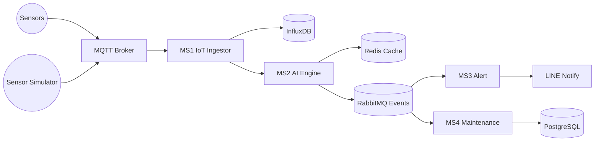

# OmniVigil Architecture (Stub)

## High-Level Data Flow

## Service Responsibilities
- MS1: Clean telemetry, ingest, and forward for analysis.
- MS2: Score anomalies, trigger alert/work-order pipeline.
- MS3: Simulate multichannel alert delivery.
- MS4: Simulate maintenance work orders and history.
