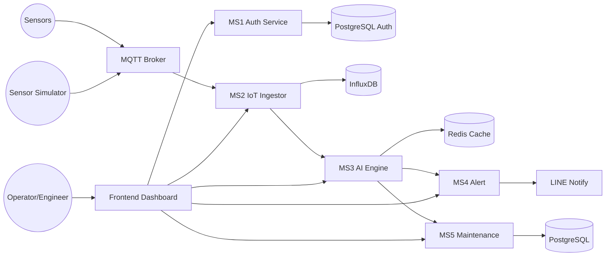

# OmniVigil Architecture

## High-Level Data Flow

## Service Responsibilities
- MS1 Auth: login + JWT + role-based authorization
- MS2 Ingestor: รับ/clean ข้อมูล telemetry และเก็บลง InfluxDB
- MS3 AI Engine: วิเคราะห์ anomaly score/risk และเรียก MS4/MS5 ผ่าน API
- MS4 Alert: รับคำขอแจ้งเตือนแล้วส่งออกหลายช่องทาง
- MS5 Maintenance: รับคำขอจาก MS3 เพื่อเปิด/ติดตามใบสั่งซ่อม

## Security Boundary
- Frontend และทุก backend service ต้องใช้ JWT จาก MS1
- service-to-service call ที่มีสิทธิ์สำคัญควรตรวจ token ผ่าน `/auth/verify`
- แยกฐานข้อมูล auth กับ maintenance ออกจากกันเพื่อลด coupling
